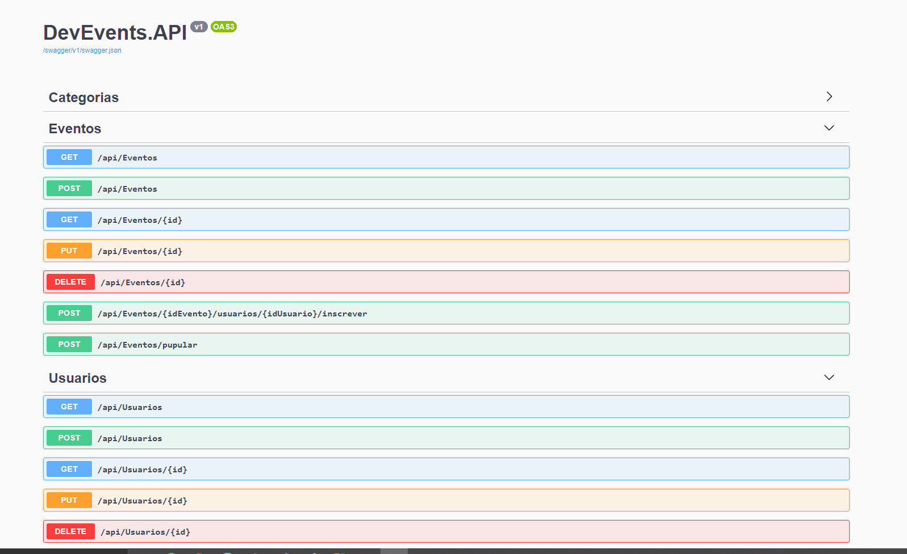

<h1 align="center">
    DevEvents
     
</h1>
<h4 align="center">
  Cadastre seus eventos para comunidade dev. 
  Api REST   
</h4>

  <a href="#rocket-technologies">Technologies</a>&nbsp;&nbsp;&nbsp;|&nbsp;&nbsp;&nbsp;

  

## :rocket: Technologies

This project was developed with the following technologies:

- [Entity Framework](https://docs.microsoft.com/pt-br/ef/)
- [Dapper](https://docs.microsoft.com/pt-br/archive/msdn-magazine/2016/may/data-points-dapper-entity-framework-and-hybrid-apps)
- [SQL Server](https://docs.microsoft.com/pt-br/sql/?view=sql-server-ver15)

Made with ❤ [Igor Marchi](https://www.linkedin.com/in/igor-marchi/) :laughing:
